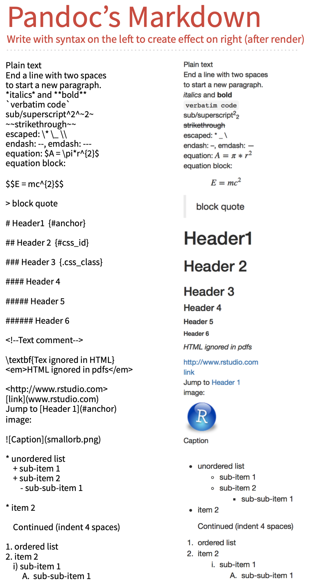

```{r setup, include=FALSE}
knitr::opts_chunk$set(echo = FALSE,dev = 'pdf',fig.align='center')
```

## Tutorial Overview

* TA: Lehang Zhong (lehang.zhong@mail.utoronto.ca)

* PhD Student in Biostatistics (Statistical Genetics)

* Goal:
  + Answer questions
  + R help session
  + Practice problems

* Attendance: Google Forms

* Communication: interactive and efficient

## Quiz


## R Markdown

* R Markdown is an integrated tool for 
    + Analysis: save and execute code
    + Report: generate high quality reports that can be shared with an audience

* Embed R code in a \LaTeX (pdf)/html/word document
    + Show R results (in figures and tables)

* Pandoc's markdown requires less formatting than \LaTeX
	
	+ Can always use latex code in markdown	document for customized options

## What do you need to make an R Markdown file?

* [Rstudio](<https://rstudio.com/)

* Some great R packages: \texttt{tidyverse} & \texttt{knitr}

* [TinyTeX](https://yihui.org/tinytex/)

* Some great resources:
    + R Markdown lessons: (<https://rmarkdown.rstudio.com/lesson-1.html>)
    + Cheatsheet: (<https://github.com/rstudio/cheatsheets/raw/master/rmarkdown-2.0.pdf>)
    + Reference: (<https://rstudio.com/wp-content/uploads/2015/03/rmarkdown-reference.pdf>)


## Demo on generating reports using R Markdown

* Create a Rmd document

```{r p1 ,echo=FALSE,fig.cap= "Create a RMarkdown Document in RStudio", out.width='0.5\\textwidth'}
knitr::include_graphics('./create_rmd.png')
```

## Basic formatting


```{r  ,echo=FALSE,fig.cap= "Simple code chunk setting", out.width='0.9\\textwidth'}

```


## Mathtype
\Fontvii
* complex equations may require `\usepackage{amsmath}` and `\usepackage{mathtools}`

* inline math mode: `$...$`

`$\ell(\pi \mid y)=\left(\begin{array}{l}n \\ y\end{array}\right) \pi^{y}(1-\pi)^{n-y}$`

* likelihood function of $Bin(n,\pi)$:$\ell(\pi \mid y)=\left(\begin{array}{l}n \\ y\end{array}\right) \pi^{y}(1-\pi)^{n-y}$

* `$$...$$` equation block
$$\ell(\pi \mid y)=\left(\begin{array}{l}n \\ y\end{array}\right) \pi^{y}(1-\pi)^{n-y} $$


## Score CI
\Fontvii
$$
\begin{array}{c}
\hat{\pi}\left(\frac{n}{n+z_{\alpha / 2}^{2}}\right)+\frac{1}{2}\left(\frac{z_{\alpha / 2}^{2}}{n+z_{\alpha / 2}^{2}}\right) \pm \\
z_{\alpha / 2} \sqrt{\frac{1}{n+z_{\alpha / 2}^{2}}\left[\hat{\pi}(1-\hat{\pi}) \frac{n}{n+z_{\alpha / 2}^{2}}+\frac{1}{4}\left(\frac{z_{\alpha / 2}^{2}}{n+z_{\alpha / 2}^{2}}\right)\right]}
\end{array}
$$

`$$
\begin{array}{c}
\hat{\pi}\left(\frac{n}{n+z_{\alpha / 2}^{2}}\right)+\frac{1}{2}\left(\frac{z_{\alpha / 2}^{2}}{n+z_{\alpha / 2}^{2}}\right) \pm \\
z_{\alpha / 2} \sqrt{\frac{1}{n+z_{\alpha / 2}^{2}}\left[\hat{\pi}(1-\hat{\pi}) \frac{n}{n+z_{\alpha / 2}^{2}}+\frac{1}{4}\left(\frac{z_{\alpha / 2}^{2}}{n+z_{\alpha / 2}^{2}}\right)\right]}
\end{array}
$$`

##  Code Chunks:
* Lecture 2 page 2 example: 

````md
```{r ex1, echo=T}`r ''`
set.seed(123)
dbinom(0:5, 5, p=1/4)
```
````

```{r ex1, echo=T}
set.seed(123)
dbinom(0:5, 5, p=1/4)
```


## Basic code chunk options

* ```echo = FALSE```: prevents code, but not the results from appearing in the finished file. This is a useful way to embed figures.

* ```include = FALSE``` prevents code and results from appearing in the finished file. R Markdown still runs the code in the chunk, and the results can be used by other chunks.

```{r p2 ,echo=FALSE,fig.cap= "Simple code chunk setting", out.width='0.5\\textwidth'}

```

## Code Chunks with figures

\Fontvi
````md
```{r p30,echo=F}`r ''`
par(mfrow=c(2,2))
plot(0:5, dbinom(0:5, 5, 1/4), type="h", xlab="y",
     ylab="P(y)",col="red", lwd=2)
plot(0:100, dbinom(0:100, 100, 1/4), type="h", xlab="y",
     ylab="P(y)", col="red", lwd=2)
pbinom(2, 5, 1/4)
```
````


```{r p30,echo=F}
par(mfrow=c(2,2))
plot(0:5, dbinom(0:5, 5, 1/4), type="h", xlab="y",
     ylab="P(y)",col="red", lwd=2)
plot(0:100, dbinom(0:100, 100, 1/4), type="h", xlab="y",
     ylab="P(y)", col="red", lwd=2)
pbinom(2, 5, 1/4)
```

## More figure code chunk options
\Fontvi
````md
```{r p31,echo=FALSE,fig.cap= "This is a figure caption", out.width='0.7\\textwidth'}`r ''`
plot(0:100, dbinom(0:100, 100, 1/4), type="h", xlab="y",
     ylab="P(y)", col="red", lwd=2)
```
````

```{r p31,echo=FALSE,fig.cap= "This is a figure caption.", out.width='0.7\\textwidth'}
plot(0:100, dbinom(0:100, 100, 1/4), type="h", xlab="y",
     ylab="P(y)", col="red", lwd=2)
```

## Muliple figures with captions
\fontsize{4pt}{7.2}\selectfont
* Only supported in \LaTeX pdf output, requires LaTeX package \texttt{subfig}

````md
```{r, fig.cap='Combine multiple plots with subcaptions', fig.subcap=c('F1','F2','F3','F4'), fig.ncol = 4, out.width = "25%", fig.align = 'center'}`r ''`
plot(0:5, dbinom(0:5, 5, 1/4), type="h", xlab="y",ylab="P(y)",col="red", lwd=2)
plot(0:100, dbinom(0:100, 100, 1/4), type="h", xlab="y",ylab="P(y)", col="red", lwd=2)
plot(cars, pch = 19)
boxplot(Sepal.Width ~ Species, data = iris)
```
````

```{r, fig.cap='Combine multiple plots with subcaptions', fig.subcap=c('F1','F2','F3','F4'), fig.ncol = 4, out.width = "25%", fig.align = 'center'}
plot(0:5, dbinom(0:5, 5, 1/4), type="h", xlab="y",
     ylab="P(y)",col="red", lwd=2)
plot(0:100, dbinom(0:100, 100, 1/4), type="h", xlab="y",
     ylab="P(y)", col="red", lwd=2)
plot(cars, pch = 19)
boxplot(Sepal.Width ~ Species, data = iris)
```

## Tables
* `knitr::kable` function format R output into tables.
* `format="latex"` should be consistent with your file.

```{r,out.width='0.5\\textwidth'}
library(binom)
knitr::kable(binom.confint(x=4, n=400, conf.level=.95, methods =c("ac","wilson", "lrt","exact")),
             format="latex",digits=4,caption = 'Example from Lec4 page 4')
```

\Fontvi
````md
```{r,out.width='0.5\\textwidth'}`r ''`
library(binom)
knitr::kable(binom.confint(x=4, n=400, conf.level=.95, methods =c("ac","wilson", "lrt","exact")),
             format="latex",digits=4,caption = 'Example from Lec3 page 10')
```
````


